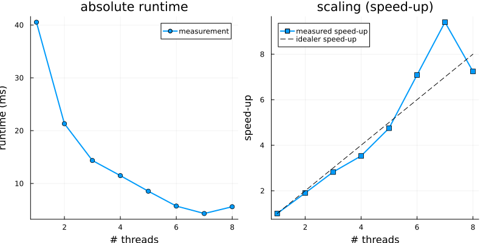

# Parallelism-related Topics and Patterns

## Overview 

### Types of Parallelism in a Computer

There are many different possibilities to parallelize workflows on classical CPUs. 

The CPU itself exposes already some of them like wide *vector registers* (SSE, AVX, AVX2, AVX512; much like GPUs), but also pipelining (and out of order execution). 

A CPU nowadays has several CPU cores, which might share different levels of caches (L1I/L1D, L2, L3, ...). Sitting on the same L1 cache, mostly 2, less often 4, such cores simply represent multiplication of the instruction pipeline. We'll call those *hardware threads* or *hyper-threads* - the operating system (OS) calls them often *logical CPUs*. In contrast, all hyper-threads belonging together, are called *physical CPUs*.

Physical CPU cores sharing a common *last-level cache* (LLC) usually sit together on a NUMA (*n*on-*u*niform *m*emory *a*ccess) domain, meaning that they still have access to the same memory infra-structure (memory bus) - though access speed might differ.

Finally, there might be one or two (or, rarely more) such NUMA domains on a socket (interconnected e.g. by a QPI == *q*uick-*p*ath *i*nterconnect). And a computer might possess one or more sockets on a board.

<br>

On those cores, the OS distributes processes and threads. The latter usually sort of "low-budget processes", attached together in a process structure (parent/child). The OS must choose the locations (the specific CPU core), where the processes and threads run on. Users can usually also determine that - within limits.

If two threads/processes run on the same CPU, the OS gives them a time slot where they can run. After that period, the OS stops the process/thread, saves the related cache and state data, and then brings in the next process filling the cache and pipeline. This is called a *context switch*. And such processes only appear to us to run in parallel. In fact, they don't. They are only *multiplexed*. This type of "parallelism", most programmers call *concurrency*, sparing the term *parallel* really only for processes running contemporarily (independently at the same time) on different CPUs.

It is hopefully immediately clear that concurrency in that sense actually means sharing of resources, which is already due to the context switching very inefficient. And thus, that's not desirable for HPC. One should be carefully check the placement of processes and threads, therefore. It has a really strong performance impact.

### Scaling Laws and Limits of Parallelism
In short: If a serial program requires a time $T_1$ to complete, where a fraction, $0\le p\le1$, of that work can be parallelized, and if we have $N$ workers then, to which we distribute the workload, the total runtime of the parallel program should be shorter by
```math
T_N = (1-p)T_1 + p\frac{T_1}{N} = \left(1 - \left(1-\frac{1}{N}\right)p\right) T_1 \le T_1\;.
```
We can re-express that in terms of *speed-up*: $S_N = T_1 / T_N$ (How much faster is the parallel execution with $N$ workers with respect to the serial execution?).
```math
S_N = \frac{1}{(1-p)+p/N}\;,
```
or, as a *parallel efficiency* $\varepsilon_N$ (in comparison to ideal scaling) by
```math
\varepsilon_N = \frac{T_1/N}{T_N}=\frac{1}{N(1-p)+p}\;\quad(0\le\varepsilon_N\le1).
```
This is [*Amdahl's Law*](https://en.wikipedia.org/wiki/Amdahl%27s_law). The essence is that with this simple model, we can make simple assessments about possible speed-up gains from simple scaling experiments - even if this model does not incorporate things like IO or communication (or, generally, parallelization) overhead. It is usually a good idea to have such a model in mind to gauge expectations about the code to be parallelized, to judge about performance issues, and to plan parallel HPC jobs (runtime estimation, CPU/GPU budget planning, etc.).

For the later experiments, $T_1$, $T_N$ and $N$ are to be measured/determined, from which $S_N$ and $\varepsilon_N$ can be calculated.


## Parallel Programming Models in Julia

We will look at the following programming models for parallelism, how they can be employed in Julia.

- simd / vectorization
- threads
- parallel workers and task-parallelism
- message passing

### SIMD (Vectorization)
For many purposes, LLVM does already loop auto-vectorization. For instance,
```julia
julia> A = rand(1000);

julia> B = rand(1000);

julia> @code_native debuginfo=:none A .+ B
...
...
.LBB0_61:                               # %vector.body
                                        # =>This Inner Loop Header: Depth=1
	vmovupd	ymm0, ymmword ptr [rcx + 8*r8]
	vmovupd	ymm1, ymmword ptr [rcx + 8*r8 + 32]
	vmovupd	ymm2, ymmword ptr [rcx + 8*r8 + 64]
	vmovupd	ymm3, ymmword ptr [rcx + 8*r8 + 96]
	vaddpd	ymm0, ymm0, ymmword ptr [rdx + 8*r8]
	vaddpd	ymm1, ymm1, ymmword ptr [rdx + 8*r8 + 32]
	vaddpd	ymm2, ymm2, ymmword ptr [rdx + 8*r8 + 64]
	vaddpd	ymm3, ymm3, ymmword ptr [rdx + 8*r8 + 96]
	vmovupd	ymmword ptr [rsi + 8*r8], ymm0
	vmovupd	ymmword ptr [rsi + 8*r8 + 32], ymm1
	vmovupd	ymmword ptr [rsi + 8*r8 + 64], ymm2
	vmovupd	ymmword ptr [rsi + 8*r8 + 96], ymm3
...
```
The compiler vectorizes only to ymm-registers (AVX2) instead of zmm-registers (AVX512). xmm = ymm/2, ymm=zmm/2. Using zmm registers, we could expect some speedup of two wrt. ymm register usage, and even a speedup factor of four wrt. xmm register usage.
`vaddpd` is the vector add instruction for packed (that's important - we don't want "serial" ymm register usage) double values.

Let's look at something simpler. Let's write a function that sums up all array elements.
```julia
 function only_sum(A)
	s = 0.0
	for i in eachindex(A)
		s += A[i]
	end
	s
end
```
Checking the assembly output, we obtain:
```julia
julia> A = rand(1000);

julia> @code_native debuginfo=:none only_sum(A)
...
.LBB0_6:                                # %L30
                                        # =>This Inner Loop Header: Depth=1
	vaddsd	xmm0, xmm0, qword ptr [rcx + 8*rdx]
	vaddsd	xmm0, xmm0, qword ptr [rcx + 8*rdx + 8]
	vaddsd	xmm0, xmm0, qword ptr [rcx + 8*rdx + 16]
	vaddsd	xmm0, xmm0, qword ptr [rcx + 8*rdx + 24]
	vaddsd	xmm0, xmm0, qword ptr [rcx + 8*rdx + 32]
	vaddsd	xmm0, xmm0, qword ptr [rcx + 8*rdx + 40]
	vaddsd	xmm0, xmm0, qword ptr [rcx + 8*rdx + 48]
	vaddsd	xmm0, xmm0, qword ptr [rcx + 8*rdx + 56]
...
```
xmm registers are half as wide as the ymm registers. Let's say, that's very moderate vectorization. The reason is not so clear. Careful compiler!

Let's try something else.
```julia
julia> A = rand(1000);

julia> function simd_sum(A)
           s = 0.0
           @simd for i in eachindex(A)                     # <- @simd
               @inbounds s += A[i]                         # @inbound : don't check array bounds 
           end
           s
       end
simd_sum (generic function with 1 method)

julia> @code_native debuginfo=:none simd_sum(A)
...
.LBB0_5:                                # %vector.ph
	movabs	rdx, 9223372036854775792
	and	rdx, rax
	movabs	rsi, offset .LCPI0_0
	vbroadcastsd	ymm0, qword ptr [rsi]
	movabs	rsi, offset .LCPI0_1
	vmovapd	ymm1, ymmword ptr [rsi]
	xor	esi, esi
	vmovapd	ymm2, ymm0
	vmovapd	ymm3, ymm0
	.p2align	4, 0x90
.LBB0_6:                                # %vector.body
                                        # =>This Inner Loop Header: Depth=1
	vaddpd	ymm1, ymm1, ymmword ptr [rcx + 8*rsi]
	vaddpd	ymm0, ymm0, ymmword ptr [rcx + 8*rsi + 32]
	vaddpd	ymm2, ymm2, ymmword ptr [rcx + 8*rsi + 64]
	vaddpd	ymm3, ymm3, ymmword ptr [rcx + 8*rsi + 96]
	add	rsi, 16
	cmp	rdx, rsi
	jne	.LBB0_6
# %bb.7:                                # %middle.block
	vaddpd	ymm0, ymm0, ymm1
	vaddpd	ymm0, ymm2, ymm0
	vaddpd	ymm0, ymm3, ymm0
	vextractf128	xmm1, ymm0, 1
	vaddpd	xmm0, xmm0, xmm1
	vshufpd	xmm1, xmm0, xmm0, 1             # xmm1 = xmm0[1,0]
	vaddsd	xmm0, xmm0, xmm1
	cmp	rax, rdx
	je	.LBB0_9
	.p2align	4, 0x90
...
```
Ok. Better. But that's still not the optimum.

There is a module, [`LoopVectorization`](https://github.com/JuliaSIMD/LoopVectorization.jl). Let's try that one.
```julia
julia> A = rand(1000);

julia> using LoopVectorization

julia> function avx512_sum(A)
           s = 0.0
           @turbo for i in eachindex(A)
               @inbounds s += A[i]
           end
           s
       end
avx512_sum (generic function with 1 method)

julia> @code_native debuginfo=:none avx512_sum(A)
...
.LBB0_5:                                # %L42
                                        # =>This Inner Loop Header: Depth=1
	vaddpd	zmm6, zmm6, zmmword ptr [rax + 8*rcx]
	vaddpd	zmm7, zmm7, zmmword ptr [rax + 8*rcx + 64]
	vaddpd	zmm5, zmm5, zmmword ptr [rax + 8*rcx + 128]
	vaddpd	zmm4, zmm4, zmmword ptr [rax + 8*rcx + 192]
	vaddpd	zmm2, zmm2, zmmword ptr [rax + 8*rcx + 256]
	vaddpd	zmm3, zmm3, zmmword ptr [rax + 8*rcx + 320]
	vaddpd	zmm1, zmm1, zmmword ptr [rax + 8*rcx + 384]
	vaddpd	zmm0, zmm0, zmmword ptr [rax + 8*rcx + 448]
	vaddpd	zmm6, zmm6, zmmword ptr [rax + 8*rcx + 512]
	vaddpd	zmm7, zmm7, zmmword ptr [rax + 8*rcx + 576]
	vaddpd	zmm5, zmm5, zmmword ptr [rax + 8*rcx + 640]
	vaddpd	zmm4, zmm4, zmmword ptr [rax + 8*rcx + 704]
	vaddpd	zmm2, zmm2, zmmword ptr [rax + 8*rcx + 768]
	vaddpd	zmm3, zmm3, zmmword ptr [rax + 8*rcx + 832]
	vaddpd	zmm1, zmm1, zmmword ptr [rax + 8*rcx + 896]
	vaddpd	zmm0, zmm0, zmmword ptr [rax + 8*rcx + 960]
	sub	rcx, -128
	add	rdi, -2
	jne	.LBB0_5
.LBB0_6:                                # %L64.unr-lcssa
	test	sil, 64
	jne	.LBB0_8
# %bb.7:                                # %L42.epil.preheader
	vaddpd	zmm6, zmm6, zmmword ptr [rax + 8*rcx]
	vaddpd	zmm7, zmm7, zmmword ptr [rax + 8*rcx + 64]
	vaddpd	zmm5, zmm5, zmmword ptr [rax + 8*rcx + 128]
	vaddpd	zmm4, zmm4, zmmword ptr [rax + 8*rcx + 192]
	vaddpd	zmm2, zmm2, zmmword ptr [rax + 8*rcx + 256]
	vaddpd	zmm3, zmm3, zmmword ptr [rax + 8*rcx + 320]
	vaddpd	zmm1, zmm1, zmmword ptr [rax + 8*rcx + 384]
	vaddpd	zmm0, zmm0, zmmword ptr [rax + 8*rcx + 448]
.LBB0_8:                                # %L64
	vaddpd	zmm0, zmm4, zmm0
	vaddpd	zmm4, zmm5, zmm1
	vaddpd	zmm1, zmm7, zmm3
	vaddpd	zmm1, zmm1, zmm0
	vaddpd	zmm0, zmm6, zmm2
	vaddpd	zmm0, zmm0, zmm4
...
```
Nice!! zmm registers.

Let's measure whether this also helped somehow.
```julia
julia> using BenchmarkTools

julia> @btime only_sum($A);
  1.640 μs (0 allocations: 0 bytes)

julia> @btime simd_sum($A);
  109.011 ns (0 allocations: 0 bytes)

julia> @btime avx512_sum($A);
  55.786 ns (0 allocations: 0 bytes)
```
That's interesting, isn't it? So, using AVX512 enhances a lot!! 

But wait! Do these functions all the same thing, too? (Correctness first!!)
```julia
julia> only_sum(A)
501.71105330489524

julia> simd_sum(A)
501.71105330489536

julia> avx512_sum(A)
501.71105330489536
```
Ok. Good enough!

**Inline Task:** Let's return to the former addition of two arrays. As we don't get ahead with `A .+ B`, let's write that as a normal function, where the result is returned in-place (`C` must already exist).
```julia
julia> function add_for!(C, A, B)
           @inbounds for i in eachindex(A, B, C)
               C[i] = A[i] + B[i]
           end
       end
add_for! (generic function with 1 method)
```
What does `@code_native` show? ... (`@. C = A + B` ... ?)
Does `@simd` help? Does `@turbo` help?
Also benchmark! What do you find?

<details>
	<summary>Conclusion</summary>

The other function definitions are:
```julia
function add_simd!(C, A, B)
	@inbounds @simd for i in eachindex(A, B, C)
		C[i] = A[i] + B[i]
	end
end

function add_avx512!(C, A, B)
	@inbounds @turbo for i in eachindex(A, B, C)
		C[i] = A[i] + B[i]
	end
end
```
`add_for!` and `for_simd!` show ymm register. `add_avx512!` contains zmm registers. So far, ok. Let's benchmark - and check correctness.
```julia
julia> @btime add_for!($C,$A,$B);
  123.556 ns (0 allocations: 0 bytes)

julia> @btime add_simd!($C,$A,$B);
  125.613 ns (0 allocations: 0 bytes)

julia> @btime add_avx512!($C,$A,$B);
  154.747 ns (0 allocations: 0 bytes)

julia> add_for!(C,A,B)

julia> D = similar(A);

julia> add_simd!(D,A,B)

julia> E = similar(A);

julia> add_avx512!(E,A,B)

julia> C == D
true

julia> C == E
true
```
At least, all functions return the same result. But vectorization doesn't seem to be beneficial. Honestly, it shouldn't. The array addition is known to be memory bound. The CPUs idle waiting for the data from the memory. 
But it doesn't matter if one doesn't know these details. We can simply try and measure. And take what's the best!
</details>

### Threads
[`Threads`](https://docs.julialang.org/en/v1/manual/multi-threading/) are already included into the `Base` package in Julia.

Using threading is rather direct. Here a `for`-loop example.
```shell
> julia --threads 4 -e 'println(Threads.nthreads())'
4
> julia -t 4 -e 'Threads.@threads for i = 1:10 println(Threads.threadid()) end'
3
5
5
2
2
2
3
4
4
4
```
**So, usage is simple in this case! Annotate the for-loops. Only go sure that there are no loop-carried dependencies!!**
A simple way to check that, is to reserse the order of loop iterations, and to check whether the result is still the same.

Instead of `--threads`, also `-t` can be used. Thread IDs don't start with 1 (kept for the main julia process)!


#### HPC related Issues

Thread-to-CPU placement and pinning. For HPC (performance), it is essential to fix the threads on certain CPUs, and especially not to let several threads run on the same CPU. The `ThreadPinning` package can help here.
```shell
> julia -t 4 -e 'using ThreadPinning; threadinfo()'
```
shows how threads are placed randomly. Possibly also on top of each other.

You can use an environment variable `JULIA_EXCLUSIVE=1 julia --threads 4 ...` to pin and place the threads uniquely (as far as possible). From the `ThreadPinning` package, you can even have a finer control via `pinthreads(:cores)`, where you specify a list of CPU IDs, and whether to pin to cores or to sockets. One even can (re-)use a threadpool. (Checkout `??pinthreads`.)
Use `threadinfo()` to check correctness placement and pinning.

<br>

The combination of SIMD and threads is a bit more cumbersome. The simplest way is maybe again via [`LoopVectorization`](https://github.com/JuliaSIMD/LoopVectorization.jl), and the `@tturbo` macro,
```julia
using LoopVectorization

# serial loop
function matmul_serial!(C, A, B)
    # Important (remember): loop sequence i, k, j is in Julia (column-based) optimum
    C .= 0.0
    for j in axes(B, 2), k in axes(A, 2), i in axes(A, 1)
        @inbounds C[i, j] += A[i, k] * B[k, j]
    end
end

# SIMD and threaded loop (with @tturbo)
function matmul_tturbo!(C, A, B)
    @tturbo for j in axes(B, 2), i in axes(A, 1)
        Cij = 0.0
        for k in axes(A, 2)
            Cij += A[i, k] * B[k, j]
        end
        C[i, j] = Cij
    end
end
```
**Inline Task:** Please, benchmark both functions with the following matrixes.
```julia
A = rand(1000,1000);
B = rand(1000,1000);
C = similar(A);

using BenchmarkTools

@btime matmul_serial!($C, $A, $B)

@btime matmul_tturbo!($C, $A, $B)
```
and with 4 julia threads (`julia -t 4`).

What do you observe?

<details>
	<summary>Conclusion</summary>

`matmul_serial!` is way slower than `matmul_tturbo!`, as expected. Also already for a single thread. (Factor 7 about.)

Also try
```julia
using LinearAlgebra

@btime C .= A * B
```
It's a bit faster than the single-thread `matmul_tturbo!`.

Maybe better use `LinearAlgebra` ... `C .= A * B`. ;) 
And yes. It's also threaded, if you want, and usually well optimized ... 

Btw. here a small script how scaling tests could be done. There is unfortunately no way to set the number of threads from inside a julia script.
```julia
using Plots
using Serialization

thread_bereich = 1:Threads.nthreads()
results = Float64[]

@info "Start automated benchmarks on $thread_bereich threads..."

for t in thread_bereich
   	@info "Benchmark running in subprozess with t = $t threads..."
    
   	julia_code = """
	    using BenchmarkTools
    	using Serialization
    	using LoopVectorization

    	function matmul_tturbo!(C, A, B)
        	@tturbo for j in axes(B, 2), i in axes(A, 1)
            	Cij = 0.0
            	for k in axes(A, 2)
                	Cij += A[i, k] * B[k, j]
            	end
            	C[i, j] = Cij
        	end
    	end
    
    	A = rand(1000,1000)
    	B = rand(1000,1000)
    	C = similar(A)

    	# Warmup
    	matmul_tturbo!(C, A, B)
    
    	b = @benchmark matmul_tturbo!(C, A, B) 
    
    	time_ms = mean(b).time / 1e6
    
    	serialize("temp_time.dat", time_ms)
   	"""
    
   	run(`julia -t $t -e $julia_code`)
    
   	time = deserialize("temp_time.dat")
   	push!(results, time)
end

rm("temp_time.dat", force=true)

@info "Benchmarks finished. Generate plots..."

p1 = plot(thread_bereich, results, 
          markershape = :circle, 
          xlabel = "# threads", 
          ylabel = "runtime (ms)", 
          title = "absolute runtime", 
          label = "measurement", 
          lw = 2)

speedup = results[1] ./ results

p2 = plot(thread_bereich, speedup, 
          markershape = :square, 
          xlabel = "# threads", 
          ylabel = "speed-up", 
          title = "scaling (speed-up)", 
          label = "measured speed-up", 
          lw = 2,
          legend = :topleft)

plot!(p2, thread_bereich, thread_bereich, 
      label = "idealer speed-up", 
      linestyle = :dash, 
      color = :black)

plot(p1, p2, layout = (1, 2), size = (800, 400))

savefig("scaling_plot.pdf")
```
As a script, it should be executed as `JULIA_EXCLUSIVE=1 julia -t 8 scaling.jl`.

A result may look like the following figure.

<div align="center">
  
</div>
</details>

#### Nested Loops

Another point are the loops themselves. If the trip-count of loops is too small, one does possibly not benefit from thread parallelism (not enough workload for each thread). This might be especially true for nested loops. If you have e.g. the following nested loop,
```julia
for i in 1:20
   for j in 1:30
      do_somthing_on(i,j)
   end
end
```
You need to decide which loop to annotate. If you would do on both, 
```julia
using Base.Threads
@threads for i in 1:20
   @threads for j in 1:30
      println("Thread $(threadid()) processing i=$i, j=$j")
   end
end
```
it seems unclear whether we finish in nested threading instead. Julia might still distribute the loop iterations only on the number of threads specified via `-t/--threads` options. But better check.

Flattened loops don't work.
```julia
using Base.Threads
@threads for i in 1:20, j in 1:30
      println("Thread $(threadid()) processing i=$i, j=$j")
end
```
will result in
```
ERROR: LoadError: ArgumentError: nested outer loops are not currently supported by @threads
```

The probably most reasonable way is to merge the loops into one single loop.
```julia
@threads for idx in CartesianIndices((1:5, 1:5))
    i = idx[1]
    j = idx[2]
    println("Thread $(threadid()) processing i=$i, j=$j")
end
```
**Again, check whether loop-carried dependencies exist!** That's in nested loops sometimes especially tricky!

#### Issues of Threading, Nested Threading

Threads are not always a safe programming model! Think about *dead-locks* and *data-races*! You are dealing with threads, that's what you may get.

It is possible to spawn and join threads arbitrarily. Here is an example of explicit thread creation from the direct-help.
```julia
julia> Threads.nthreads()
4

julia> f(x) = x^2
f (generic function with 1 method)

julia> t₅ = Threads.@spawn f(5)
Task (runnable, started) @0x00007f9104fd82e0

julia> a = fetch(t₅)
25

julia> t() = println("Hello from ", Threads.threadid());

julia> tasks = fetch.([Threads.@spawn t() for i in 1:Threads.nthreads()]);
Hello from 2
Hello from 5
Hello from 4
Hello from 3
```
There's really a lot of freedom and flexibility. But that comes at a price. If threads share common data structures, synchronization like *locks* are required in order to prevent data-races. And locks in turn are prone to dead-locks. That's specific to threads! Not to Julia.

<br>

Furthermore, packages like [`LinearAlgebra`](https://docs.julialang.org/en/v1/stdlib/LinearAlgebra/) (OpenBLAS) and [`MKL`](https://github.com/JuliaLinearAlgebra/MKL.jl) provide own OpenMP thread control. That's somewhat external to julia, i.e. there are no julia threads used. Thread-nesting is not forbidden, but merely a little dangerous. It requires some care not to overcommit on a given hardware. A sure symptom of overcommitment is a vast loss of performance (up to even system hang-up).
Use `BLAS.set_num_threads(1)` to set the required number of threads for the BLAS workflows. Environment variables like `OPENBLAS_NUM_THREADS` and `MKL_NUM_THREADS`, respectively, or more general, `OMP_NUM_THREADS`, can also be used.

That's not of an issue if you run your julia programs serially - `julia -t 1`. Then you can use all CPUs avaiable for the linear algebra stuff.

To get some feeling for it, play a bit with the following.
```julia
julia> using LinearAlgebra

julia> A = rand(Float64,100,100);

julia> b = rand(Float64,100);

julia> x = A\b
...
```
and benchmark (`BenchmarkTools`).

#### Final Remark
Another often seen package for loop parallelization is [`FLoops`](https://github.com/JuliaFolds/FLoops.jl). It extends `Threads` in some ways. But follows otherwise the same semantics.


### Task-Parallelism (Distributed, pmap)
Next to threading, julia offers another very versatile parallel programming model for CPU systems ... even for multi-node systems. The [Distributed](https://github.com/JuliaLang/Distributed.jl) package provides support for so-called server-client/master-slave parallelism. The idea is that some "master" controls and distributes workload to other workers. A rather comprehensive documenation can be found here: [Multi-processing and Distributed Computing](https://docs.julialang.org/en/v1/manual/distributed-computing/).

For one, you can start Julia also with the option `-p/--procs <number>`. It automatically loads the `Distributed` module. Doing so, in the REPL, you then see "workers".
```julia
> julia -p 2
...

julia> nworkers()                     # number of workers
2

julia> workers()                      # list of worker IDs
2-element Vector{Int64}:
 2
 3
```
As for threads, don't get confused that Julia starts indexing workers at 2. Number 1 is the "master".

Supposedly, the workers are like threads and run on different CPUs (Cluster manager usually take care for placement and pinning. Otherwise, under Linux, you can use `taskset`).

You can add workers also internally.
```julia
> julia -p 2
...
julia> nworkers()
2

julia> addprocs(3);

julia> nworkers()
5

julia> for i in workers()
         rmprocs(i)
       end

julia> nworkers()
1
```
One always must be preserved. When julia stops, the workers are stopped usually automatically. But it is a good habit to tidy up, nonetheless.

#### Programming Model
So, what can we do with it? We need to bring workload to the worker, where it runs asynchronously, and get result back later - or wait when it is not present, yet. This concept is know as `furure` (also in other programming languages). How does it look like?
```julia
julia> myid()                        # get the worker ID
1

julia> a = @spawnat 2 myid();        # get the worker ID from a worker, myid() is spawned to worker 2

julia> r = fetch(a)                  # when result available, show us
2
```
We executed the function `myid`, which returns the worker ID, on worker 2. The "future" is stored in `a`. Later, we can `fetch` the future's result, and store it in `r`.
(Careful!! Removing and adding processes/workers might be confusing. The worker IDs once used are never reused. Better avoid this jumble!)

To do something useful, one usually defines some function that is then spawned to some or all workers (or so). Much like `myid()` above. But doing so naively like here,
```julia
> julia -p 1                          # one additional worker
...
julia> g(x) = x^2;

julia> a = @spawnat 2 g(3)

julia> b = fetch(a)
ERROR: On worker 2:
UndefVarError: `#g` not defined in `Main`
...
```
awfully fails. What happened is that `g` is not known on worker 2. We first must declare it there. So, once again, and this time correctly.
```julia
> julia -p 1
...
julia> @everywhere g(x) = x^2;        # do that on all workers

julia> a = @spawnat 2 g(3)

julia> b = fetch(a)
9                                      # Yippie!
```

This opens some other problem now, too. One needs to care for data handling at the workers. With `@everywhere data = [1,2,3,4,5]`, you can create an array on each worker. Let's look at the following example.
```julia
julia> @everywhere data = [1,2,3,4,5]

julia> @everywhere modify() = data[1]=10; 

julia> a = @spawnat 2 modify()
Future(2, 1, 20, ReentrantLock(), nothing)

julia> fetch(a)
10

julia> @everywhere @show data
data = [1, 2, 3, 4, 5]
      From worker 2:	data = [10, 2, 3, 4, 5]
```
Oops! ... Data are worker-local!

And how do I move data then? Some functions like `remotecall_fetch` can take care for it.
```julia
julia> locale_data = [10, 20, 30]

julia> ergebnis = remotecall_fetch(sum, 2, local_data)
60

julia> @everywhere @show locale_daten
ERROR: On worker 2:
UndefVarError: `locale_daten` not defined in `Main`
```
So, we moved data to worker two, did some computation, and got the result. There are no data on worker 2 remaining, though.

Conclusion: Workers need to be considered as independent Julia instances (processes) that communicate with each other through functions. Data management must be done manually.

Depending on the specific workflow requirements, one can send data with functions, or "allocate" data on the workers (via `@spawnat` or `@everywhere`). There are modules like [`SharedArrays`](https://docs.julialang.org/en/v1/stdlib/SharedArrays/) (on single machine) and [`DistributedArrays`](https://juliaparallel.org/DistributedArrays.jl/stable/) (across several machines), which can give more support for that.

<details>
	<summary>Stencil Lattice Update Example</summary>

Here is an example how one could realize a simple stencil update scheme (here, for diffusion equation with diffusion constant `c` in finite difference discretization).
```julia
using Distributed

if nworkers() == 1
    addprocs(4)
end

@everywhere using DistributedArrays

@everywhere function diffusion_step_1d(u_old::DArray, u_new::DArray, c::Float64)
    # each worker determines its local index range
    local_range = localindices(u_old)[1]
    start_idx = first(local_range)
    end_idx   = last(local_range)
    
    # local arrays for fast computation directly in worker's RAM
    u_old_local = localpart(u_old)
    u_new_local = localpart(u_new)
    
    # inner range of workers (no communication)
    for i in 2:(length(local_range) - 1)
        u_new_local[i] = u_old_local[i] + c * (u_old_local[i-1] - 2*u_old_local[i] + u_old_local[i+1])
    end
    
    # --- update boundary points (ghost cells via communication) ---
    # left boundary of workers
    if start_idx > 1
        # u_old[start_idx - 1] fetches automatically required data from left neighbor worker
        u_new_local[1] = u_old_local[1] + c * (u_old[start_idx - 1] - 2*u_old_local[1] + u_old_local[2])
    end
    
    # right boundary of workers
    if end_idx < length(u_old)
        # u_old[end_idx + 1] fetches automatically required data from right neighbor worker
        n = length(local_range)
        u_new_local[n] = u_old_local[n] + c * (u_old_local[n-1] - 2*u_old_local[n] + u_old[end_idx + 1])
    end
    
    # physical boundaries (Dirichlet BC: u fix == 0)
    if start_idx == 1
        u_new_local[1] = 0.0
    end
    if end_idx == length(u_old)
        u_new_local[end] = 0.0
    end
end

# ---- main program -----

# simulation parameters
N = 100          # number of lattice points
steps = 50       # number of time steps
c = 0.1          # diffusion constant (dt * D / dx^2)

# initialization of distributed arrays (type, dimension, worker-IDs)
# profile init (e.g. square pulse (zero left and right from a range of one in the middle))
u_old = DArray(I -> [ (idx > 40 && idx < 60) ? 1.0 : 0.0 for idx in I[1] ], (N,), workers())
u_new = dzeros(N)

println("initial state (part): ", Array(u_old)[38:62])

# simulation loop
for t in 1:steps
    # execute computation parallel on all assigned workers
    @sync for p in workers()
        @async remotecall_fetch(diffusion_step_1d, p, u_old, u_new, c)
    end
    
    # synchronisation: u_new -> u_old of next step (swap)
    # (As these are DArrays, we copy locally on each worker)
    @sync for p in workers()
        @async remotecall_fetch(p) do
            copyto!(localpart(u_old), localpart(u_new))
        end
    end
end

# fetch result back to master, and show
u_final = Array(u_old)
println("final state (part):   ", round.(u_final[38:62], digits=2))
```
`@sync` cares for a barrier such that the loop must be finished before any worker can go on. `@async` simply means that `remotecall_fetch` is executed in a non-blocking fashion on the master. Therefore, the `@sync` is required for the loop - to wait for the returning of each `remotecall_fetch` call.

The final fetch of an array is debatable in HPC circumstances. Usually, it is more clever to write out results to a file in a worker-local fashion in order to avoid memory overrun on the node of the master, and also to parallelize the IO (it's faster).

Instead of `@sync/@async`, which is rather convenient, you can but also do the same thing with `@spawnat` (`@spawn`, if you don't care which worker is used - the runtime system schedules) and `fetch()`. But then, explicit data movement/handling is also your business. 
</details>

#### Map-Reduce - pmap (jobfarming)
If you have some sort of collection (yes, it is so abstract!) - e.g. a list of different input parameters - to which you want to apply element-wise some function, then probably `pmap` is the ideal mean.

An example shall illustrate this. Imagine, you want to know how many numbers there are between 1 and say 100000 divisable by 13. Using `pmap`, it goes like that.
```julia
julia> pmap(x -> x % 13 == 0 ? 1 : 0 , 1:100_000)
```
This returns an array of 0's and 1's. 1, if division modulo 13 results in zero (statement is true). To count all the single 1's, we can use `sum`, or, more generally, `reduce`.
```julia
julia> sum(pmap(x -> x % 13 == 0 ? 1 : 0 , 1:100_000))
7692

julia> reduce(+, pmap(x -> x % 13 == 0 ? 1 : 0 , 1:100_000))
7692
```
`reduce` has the benefit that we can use any kind of operation here. Not only addition.

The clue now is that it works transparently also with workers.
```julia
julia> nworkers()
1

julia> reduce(+, pmap(x -> x % 13 == 0 ? 1 : 0 , 1:100_000))

julia> addprocs(4);

julia> reduce(+, pmap(x -> x % 13 == 0 ? 1 : 0 , 1:100_000))     # schedules to 4 workers 
```
The benefit for this example is negative. `pmap` comes with quite some overhead. But if the collection (`1:100_000`) is huge, or the function applied a heavy computation, then parallelism can outweigh and even more these overhead costs.

<details>
	<summary>Jobfarming with Bookkeeping</summary>

If you have a lot of independent tasks - e.g. you want to run some program independently with many parameters for, say, uncertainty quantification, or, you want to process a bunch of input files with a program, where every file can be processed independently - and some program that should be executed in a shell (doing that directly in Julia would of course be much more efficient ;) ). Such a "job farmer" in julia can be realized as follows.

```julia
using Distributed

# setup OpenMP if julia was started with -t option, and the program is OpenMP parallel
ENV["OMP_NUM_THREADS"] = Threads.nthreads()

# create workers
nworkers() == 1 && addprocs(4)

@everywhere using Dates
@everywhere function do_work(x)
  myID = myid()
  outfile = open("$x","a")
  println(outfile,"Task ID $x on worker $myID")
  starttime = Dates.now()
  println(outfile,"** START = $x = $myID = $starttime")
  try
    line = open(readlines, "taskdb.txt")[x]
    println(outfile,"command: $line")
    write(outfile,read(Cmd(`sh -c "$line"`)))    							# <-- task executed
    endtime = Dates.now()
    elapsed = (endtime - starttime).value/60000  ## in minutes
    println(outfile,"** STOP SUCCESS = $x = $myID = $endtime = $elapsed")
  catch err
    println(outfile,"** STOP FAILED = $x = $myID = ", Dates.now())
  end
  close(outfile)
end

# check for already executed tasks and remove from TODO list (bookkeeping)
task_ID_list = []
for x in 1:countlines("taskdb.txt")
  if isfile("$x")
    if length(filter(line -> occursin(r"\*\* STOP ",line),readlines(open("$x")))) > 0
      continue
    end
  end
  push!(task_ID_list,x)
end

pmap(do_work, task_ID_list)

for i in workers()
  rmprocs(i)
end
```
All that's now required is a file named `taskdb.txt`, with each line containing one shell command. This Julia script can be executed then with `-p` in order to specify the number of workers, and `-t` for possibly threads. And it can run repeatedly until all tasks were processed (therefore, bookkeeping). 
</details>

#### SlurmClusterManager Extension
If you need to work on several nodes - because of memory requirements, or scaling larger through parallelism to get the production through, `Distributed` can be combined with cluster managers. We have only experience with [`SlurmClusterManager`](https://github.com/JuliaParallel/SlurmClusterManager.jl), so we can only show this here. All that's necessary is
```julia
using Distributed, SlurmClusterManager
addprocs(SlurmManager())
```
That's really it. The number of workers is configured via the Slurm `sbatch` parameters (`--nodes`, `--ntasks-per-node`, ...). The SlurmManager runs `srun` under the hood to distribute the workers to the respective Slurm tasks on the allocated nodes.

#### Final Remark
`Distributed` can be combined with threads. Specifically, `pmap` can distribute/schedule work on workers, where each worker might run several threads (on as many CPUs), in order to execute a function faster. 

Beware of overcommitment!


### MPI (Message Passing Interface)
If you have more complicated parallel workflow structures, and possibly a need to work across several computers (be it simply for requirements of more processing units to accelerate the execution, or be it memory requirements per note mitigation for large simulations), the now traditional way is to use the [Message Passing Interface](https://en.wikipedia.org/wiki/Message_Passing_Interface) (MPI).

Julia provides a rather complete API for it in the [MPI](https://juliaparallel.org/MPI.jl/stable/) package. The installation can be a bit troublesome depending on whether you can live with the provided MPI implementation that julia installs, or whether you want to interface the system MPI installation. Both is feasible.

Another complexity is then to gauge and use the MPI workflows (not part of this course).

But let's assume these issues are all solved, the usage is pretty simple. Let's take the "hello-world" example from the docu page.
```shell
> cat MPI-hello.jl
using MPI
MPI.Init()
comm = MPI.COMM_WORLD
println("Hello world, I am $(MPI.Comm_rank(comm)) of $(MPI.Comm_size(comm))")
MPI.Finalize()

> mpiexec -n 4 julia -- ./MPI-hello.jl
Hello world, I am 1 of 4
Hello world, I am 0 of 4
Hello world, I am 2 of 4
Hello world, I am 3 of 4
```

This can, of course, be combined with `Threads` as well - so-called "hybrid MPI+X" programming schemes. Just again, take care not to overcommit on the hardware!
I would not try to combine that with the `Distributed` parallelism, though!

That's it. More I cannot do for you at the moment. (Means, from julia-pov, we are done. The rest is to learn to use MPI itself, and the related programming models.)

<br>

Some technical detail. For using an installed system MPI, it is usually best to use [`MPIPreferences`](https://juliaparallel.org/MPI.jl/stable/reference/mpipreferences/).
```julia
using MPIPreferences
MPIPreferences.use_system_binary()
```
*Disclaimer* (though): MPI environments are quite special on HPC systems. And even more so is the integration into the resource manager and scheduler (e.g. Slurm). As in Julia, users install their modules on their own, it is also in their responsibility to correctly attach these to the environment. (For GPUs, it's the same.) But in case of issues, it is fair to simply contact the user-support.

Otherwise, just installing `MPI`, julia will provide a MPICH implemenation that you can also easily access. Just enter in the REPL
```julia
using MPI
MPI.install_mpiexecjl()
```
This creates a thin wrapper script, `~/.julia/bin/mpiexecjl`, where you afterwards only need to add `~/.julia/bin` to the `PATH` variable (under Linux/Unix ... Under Windows, I would appreciate to receive some feedback from users. I've no system where I could test that on.). Usage is then
```shell
> export PATH=~/.julia/bin:$PATH           # (place it into your ~/.bashrc or so, to make it permanent)
> mpiexecjl -n 4 julia -- ./MPI-hello.jl   # output as above
```
#### A HPC relevant Issue of MPI
If you go massively parallel, Julia's complete setup might kill any success. If 1000+ ranks try to load some module at the same time, and note that it still needs to be precompiled, and then all start to fight for write locks, etc., or the package are pre-compiled already, but they are huge in the file system, the start-up process might vastly take time. 

A workaround is to let only rank 0 load the modules first. The other ranks wait in a barrier. Once ready, rank 0 passes this barrier, too, and the other ranks then only need to load-read the modules. This removes the write-contention in the file-system.

But already the pre-compilation itself - even if only serially - can take quite some time. It is prossibly a waste of time/CPU-budget to perform the compilation during a production job with possibly thousands of CPUs then idling.
There are packages to ahead-of-time (AOT) compile complete programs. See, for instance, [`PackageCompiler`](https://julialang.github.io/PackageCompiler.jl/dev/).

## Hands-on

- [`Ray-Tracing / Path-Tracing (Visualization)`](hands-on/S3/Ray_Path_Tracing.md)
- [`Solving PDEs computationally (Tutorial)`](hands-on/S3/PDE_solver.md)
