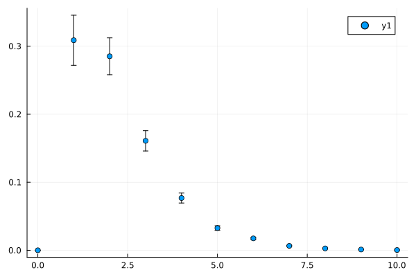
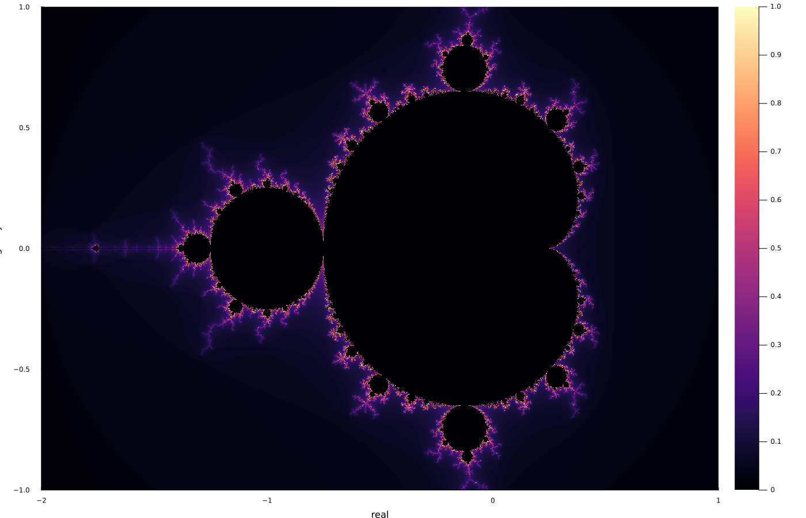
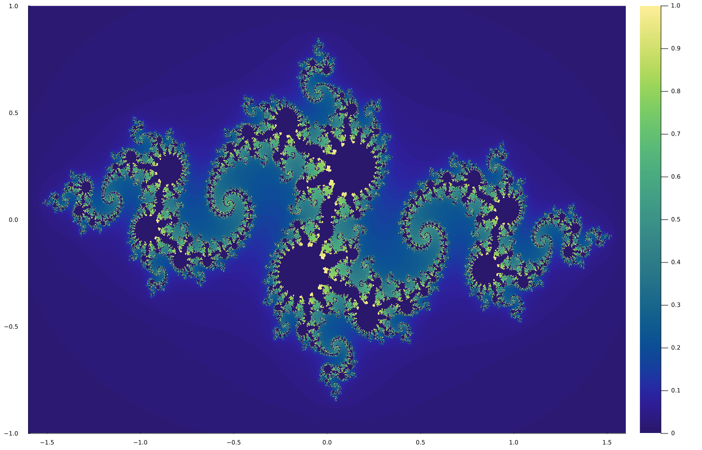

# Plotting and Curve Fitting

Julia has two quite flexible plotting modules, [`Plots`](https://docs.juliaplots.org/stable/) and [Makie](https://docs.makie.org/stable/). Let's focus on `Plots` here. The docu contains a nice tutorial as an introduction. Some short warm-up examples.
```julia
using Plots

# plot x*exp(-x) in the range [0,10]
plot(x->x*exp(-x),0,10)

# with title, label, x-axis and y-axis labels, different color
plot(x->x*exp(-x),0,10,title="Plot-Example", label="x*exp(-x)", xlabel="x", ylabel="y", color=:red)

# save to PDF file
savefig("example_plot.pdf")
```
`plot` returns a handle to the plot that can be used in savefig.
```julia
p = plot(x->x*exp(-x),0,10)
savefig(p, "example_plot.pdf")
```
`plot` has a huge and flexible interface (often overwhelming for beginners). Instead of the above, one can also use a range to set the points. Let's combine that also with plotting more than one graph in a single plot.
```julia
plot(0:1:10,x->x*exp(-x),label="with coarse resolution", linewidth=2)
plot!(0:0.01:10,x->x*exp(-x),label="with fine resolution", linewidth=2)
```
For the moment, the last thing to present is the error plot.
```julia
x = collect(0:1:10)                             # x values
f(x) = x*exp(-x)                                # f = x -> x*exp(-x)
yerr = 0.1 .* f.(x)                             # y-error (10% of function value) 
y = f.(x) .+ yerr .* randn(length(yerr))        # y values with small errors
plot(x,y,yerror=yerr, st=:scatter)              # scatter plot with error bars
```
<details>
  <summary>plot result</summary>

<div align="center">
  
</div>
</details>

Next to `plot`, there exist `scatter`, `histogram`, `heatmap`, ... and many more as convenience aliases to `plot`. The names are more telling. But `plot` also knows the `st` (`seriestype`). 

Furthermore, the different attributes like `xlabel` (`xl`), `ylabel` (`yl`) `linewidth` (`lw`),  etc. have short forms. 

Legend placement cat be done via `leg=:topleft`, etc. Remove legend, `leg=false`. `titlefont = (16, :red, :serif)` sets title font size, color and font style.

And much more ...

## Mandelbrot / Julia Sets

### Mandelbrot Sets
Mandelbrot sets can be created as follows. Take a point $c$ in the complex plane for the following iteration.
```math
z_i = z_{i-1}^2 + c\;,\qquad i = 1, 2, \ldots\;,\qquad z_0=0\;.
```
For some values of $c$, this iteration diverges, i.e. $|z_i|\rightarrow\infty$. For others, $|z_i|<\infty$ (it does not converge but follows some cycle, the magnitudes of which are limited). If somewhen $|z_i|>2$, the chance is high that the sequence diverges. Afaik, there is no exact limit known. Or, it cannot be predicted which $i$ this threshold is exceeded, or so.

It doesn't matter. We simply do the following. For each $c$, we iterate the sequence $z_i$ for $i$ from 1 to 100. If all $|z_i|\le2$, we assume convergence - and return 0. Otherwise, divergence - and for coloring, we return the index $i/100$ for $i$ for which $|z_i|>2$ (divided by 100, to get a number in $[0,1]$).

It is maybe fun to see that in Julia, we can do that in a single code line.
```julia
heatmap(-2:0.001:1,-1:0.001:1,(x,y)->(c=x+y*im; z=0+0im; for i in 1:100 z = z^2 + c; abs(z) > 2 && return i/100 end; 0), c = :magma, size=(1400,900), xl="real part", yl="imaginary part")
```
<details>
  <summary>plot result</summary>

<div align="center">
  
</div>
</details>

#### Exercise
Zoom into some region of the set, and admire the structure.

### Julia Sets
Julia sets are quite similar. The difference is that $c$ is fix ... say $c=-0.8+0.156i$ (you can play with the value). But $z_0$ is now the point from the complex plane (the role, $c$ has in the Mandelbrot set). The rest is exactly the same.

#### Exercise
Create a plot of a Julia set. Zoom into details. Admire.

<details>
  <summary>Solution. (Don't cheat! Please try yourself first! It's easy!)</summary>
  
```julia
heatmap(-1.6:0.001:1.6,-1:0.001:1,(x,y)->(c=-0.8+0.156im; z=complex(x,y); for i in 1:100 z = z^2 + c; abs(z) > 2 && return i/100; end; 0), c=:haline, size=(1400,900))
```
<div align="center">
  
</div>
</details>


## Curve Fitting

The general task: Given some data with uncertainties, e.g. from measurements, fit some parametric curves to it (not AI here!!).
In lack of real data, we'll create some for us in different ways (see below).

### Least Square Fitting (LsqFit)
The idea is simple. One has some data, $[x_i, y_i, \sigma_i]$ ($i=1,\ldots,N$), say from some measurement. $\sigma_i$ are the obtained uncertainties for the $y_i$'s. Next, you take some function, $f(x;a_1,a_2,\ldots)$, which also depends on some parameters, $a = a_1, a_2,\ldots$. "Least Squares" now means that one tries to minimize the sum of the quadratic differences between data and function with respect to these parameters (historically, it is often termed $\chi^2$ ... don't wonder).
```math
\chi^2(a) = \sum_{i=1}^N\left(\frac{y_i-f(x_i;a)}{\sigma_i}\right)^2 \rightarrow \text{min!} (\text{wrt. }a)\;.
```
In Julia, one can use e.g. the module [LsqFit](https://github.com/JuliaNLSolvers/LsqFit.jl) to accomplish this minimization (there are really quite more). The "model" is just a normal function, `f(x,a)`, in julia with `a` being possibly an array. E.g. `f(x,a) = a[1] + x*a[2]`.

The `curve_fit` function from `LsqFit` takes this model, and the data, and does the minimzation starting from some defined initial state of the parameters (please check the examples on their docu page). 

#### Exercise
Create some random data from some function - here a polynomial. (Once more using some DataFrame for convenient data handling, for instance.)
```julia
using Plots, DataFrames, Random
rng = Xoshiro(23423)
f(x) = 5x^3 - 4x^2 + 2.2x - 5.5
df = DataFrame([0:1.0:10],[:x])
transform!(df, :x => ByRow(x -> (y = f(x); yerr = y*0.1*randn(); return [y + yerr, abs(0.1*y)])) => [:y, :yerr])
plot(df.x,df.y,yerror=df.yerr, st = :scatter, markershape = :square, markercolor = :red, markeralpha = 0.8, label="measurement data")
```
In a next step, define a model with some parameters, and let `LsqFit` do the minimization for you.
```julia
a0 = [0.,0.]      # so many parameters you have
fit = curve_fit(model, df.x, df.y, weights, a0)
```
**Remark** `curve_fit` will require some weights based on the $\sigma_i$ (uncertainties). These are actually `weights[i]`$=1/\sigma_i^2$.

The result can be obtained via
```julia
a_opt = fit.param             # optimum parameters
a_se = standard_errors(fit)   # uncertainties of parameters
```
And you can add the result to the plot above
```julia
plot!(df.x, model(df.x, a_opt), label="weighted fit", lw=2, color=:red)
```

### Least Square Polynom Fitting (LinearAlgebra)


### Bayes Curve Fitting (Turing, FlexiChains)
