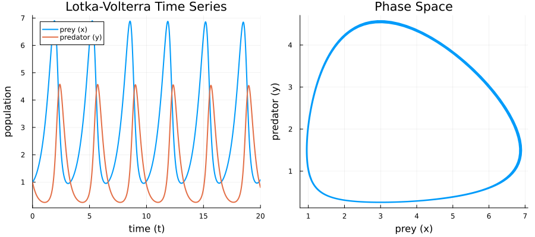
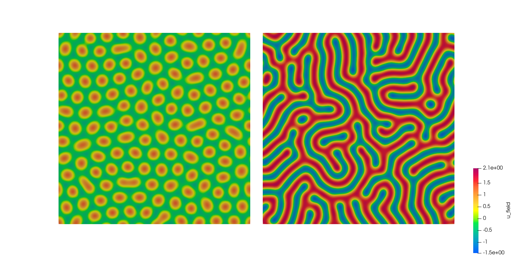

# Solving PDEs computationally (Tutorial)

## Introduction
Please look into the documentation of [`DifferentialEquations`](https://docs.sciml.ai/DiffEqDocs/stable/). There are many tutorials and examples. I guess, one cannot do better.

## Simple ODE Example (show case)
The simplest ODE standard example with still quite some complexit is probably the Lotka-Volterra model (for predator-prey-relationship).
```math
\dot{u}(t) = \frac{d}{dt}
\begin{pmatrix}
x \\ y
\end{pmatrix}
=
\begin{pmatrix}
\alpha x - \beta xy \\
\delta xy -\gamma y  
\end{pmatrix}
\;,\qquad
u(t=0) = u_0 = 
\begin{pmatrix}
x_0 \\ y_0
\end{pmatrix}
=
\begin{pmatrix}
1 \\ 1
\end{pmatrix}
```
How can one solve it in Julia?
<details>
    <summary>source code</summary>

```julia
using DifferentialEquations, Plots

# 1. define ODE system (in-place format)
function lotka_volterra!(du, u, p, t)
    x, y = u          # x: prey population, y: predator population
    α, β, δ, γ = p    # system parameters
    
    du[1] = α * x - β * x * y      # dx/dt
    du[2] = δ * x * y - γ * y      # dy/dt
end

# 2. initial conditions (IC)
u0 = [1.0, 1.0]       # start populationen for [prey, predator]

# 3. define time span for simulation
tspan = (0.0, 20.0)   # t=0 till t=20

# 4. define system parameters
# α (prey growth rate), β (hunting efficiency), δ (reproduction rate predator), γ (mortality rate predator)
p = [1.5, 1.0, 1.0, 3.0]

# 5. ode problem object
prob = ODEProblem(lotka_volterra!, u0, tspan, p)

# 6. solving computationally (Tsit5 is a modern standard solver)
sol = solve(prob, Tsit5())

# 7. plot results
# Plot 1: population development over time
p1 = plot(sol, labels=["prey (x)" "predator (y)"], lw=2)
title!("Lotka-Volterra Time Series")
xlabel!("time (t)")
ylabel!("population")

# Plot 2: phase space (predator vs prey)
p2 = plot(sol, vars=(1, 2), lw=2, legend=false)
title!("Phase Space")
xlabel!("prey (x)")
ylabel!("predator (y)")

using Plots.Measures                             # to fit later margines, such that labels aren't cut
# both plots in one
plot(p1, p2, layout=(1, 2), size=(900, 400), bottom_margin = 4mm, left_margin = 4mm)
```
</details>

<div align="center">
  
</div>

## PDE Example (showcase)
One can also solve partial different equations (PDE) with this method. Let's take as example the [Swift-Hohenberg equation](https://en.wikipedia.org/wiki/Swift%E2%80%93Hohenberg_equation).
```math
\frac{\partial}{\partial t} u(t,x,y) = \epsilon u -(1+\Delta)^2u - u^3\;,\quad t\ge0, (x,y)\in [0,L]\times[0,L]
```
```math
\text{IC: } u(t=0,x,y) = u_0(x,y)\;,\quad \text{BC: } u(t,x+L,y) = u(t,x,y) = u(t,x,y+L)
```
We require periodic boundary conditions on a square mesh. The initial condition is mostly a small random distribution around 0, as the field $u$ results as a deviation from some reference state in the derivation.

Now the fun. What's that's equation good for? It is a model equation to investigate structure formation and bifurcation - different stable solutions, depending on the system parameter: here, $\epsilon$. From a *linear stability analysis* results, that for $\epsilon=0.2$, we should obtain a hexagonal pattern. For $\epsilon>1.33$, the stripe pattern should be stable.

The computational challenge of this equation is that the 2D Laplacian, $\Delta=\frac{\partial^2}{\partial x^2}+\frac{\partial^2}{\partial y^2}$, is squared. This results in derivatives of order 4 - and thus in a very stiff system. We will use, for simplicity, finite difference discretization for the spatial coordinates.

We will use TRBDF2, which is a fully implicit Runge-Kutta integration method with time step adaptation - well suited for very stiff systems.

Finally, we also introduce the `WriteVTK` module. It will be used to write out our simulation data into a VTK format, which can be analyed using the free software [Paraview](https://www.paraview.org/).

<details>
    <summary>shg.jl</summary>

```julia
using DifferentialEquations
using LinearAlgebra
using SparseArrays
using WriteVTK

# --- 1. physics & 2D numerical parameters ---
const N = 256                        
const L = 80.0                      
const x = range(0.0, L, length=N+1)[1:N]
const y = x
const dx = L / N
const ϵ = 0.2                       #  0.2 -> heaxons; 1.4 -> stripes 
p = (N, dx, ϵ)

# --- helper to map 2D grid indices (i,j) to 1D vector index ---
@inline function get_idx(i, j, Nx)
    return i + (j - 1) * N
end

# --- 2. function to generate the exact sparsity pattern ---
function generate_sparsity_pattern(N)
    # build pattern using coordinate lists (I, J) for SparseMatrixCSC
    I = Int[]
    J = Int[]
    
    for j in 1:N
        for i in 1:N
            row = get_idx(i, j, N)
            
            # All 13 interacting neighbor offsets for 2D Swift-Hohenberg stencil
            offsets = [
                (0, 0),                             # self
                (-1, 0), (-2, 0), (1, 0), (2, 0),   # X-direction neighbors
                (0, -1), (0, -2), (0, 1), (0, 2),   # Y-direction neighbors
                (-1, -1), (-1, 1), (1, -1), (1, 1)  # diagonal components (mixed derivatives)
            ]
            
            for (di, dj) in offsets
                # apply periodic boundary conditions for pattern wrapping
                ni = mod1(i + di, N)
                nj = mod1(j + dj, N)
                col = get_idx(ni, nj, N)
                
                push!(I, row)
                push!(J, col)
            end
        end
    end
    
    # create sparse matrix skeleton (values are 1.0 just to define non-zero locations)
    return sparse(I, J, 1.0, N^2, N^2)
end

# --- 3. 2D Swift-Hohenberg System (MOL - method of lines) ---
function swift_hohenberg_2d_mol!(du, u, p, t)
    N, dx, ϵ = p
    inv_dx2 = 1.0 / (dx^2)
    inv_dy2 = 1.0 / (dx^2)
    
    U  = reshape(u, N, N)
    dU = reshape(du, N, N)
    
    for j in 1:N
        for i in 1:N
            im2 = mod1(i - 2, N); im1 = mod1(i - 1, N); ip1 = mod1(i + 1, N); ip2 = mod1(i + 2, N)
            jm2 = mod1(j - 2, N); jm1 = mod1(j - 1, N); jp1 = mod1(j + 1, N); jp2 = mod1(j + 2, N)
            
            # Laplacians
            d2x = (U[ip1, j] - 2.0*U[i, j] + U[im1, j]) * inv_dx2
            d2y = (U[i, jp1] - 2.0*U[i, j] + U[i, jm1]) * inv_dy2
            laplacian = d2x + d2y
            
            # Biharmonic stencil approximation
            d4x = (U[ip2, j] - 4.0*U[ip1, j] + 6.0*U[i, j] - 4.0*U[im1, j] + U[im2, j]) * (inv_dx2^2)
            d4y = (U[i, jp2] - 4.0*U[i, jp1] + 6.0*U[i, j] - 4.0*U[i, jm1] + U[i, jm2]) * (inv_dy2^2)
            d4_approx = d4x + d4y + 2.0 * (U[ip1,jp1] - 2.0*U[ip1,j] + U[ip1,jm1] - 2.0*U[i,jp1] + 4.0*U[i,j] - 2.0*U[i,jm1] + U[im1,jp1] - 2.0*U[im1,j] + U[im1,jm1]) * inv_dx2 * inv_dy2
            
            linear_operator = -U[i, j] - 2.0 * laplacian - d4_approx
            
            dU[i, j] = ϵ * U[i, j] + (U[i, j]^2) - (U[i, j]^3) + linear_operator
        end
    end
end

# --- 4. initialization & setup ---
u0 = 0.05 .* randn(N^2)
tspan = (0.0, 100.0)

# generate the sparsity prototype for jacobian - optimization
println("Generating Jacobi Sparsity Pattern...")
jac_sparsity = generate_sparsity_pattern(N)

# integrate pattern into ODE function using the 'jac_prototype' keyword - jacobian
ff = ODEFunction(swift_hohenberg_2d_mol!; jac_prototype = jac_sparsity)
prob = ODEProblem(ff, u0, tspan, p)

# --- 5. Solver Execution ---
println("Solving 2D Swift-Hohenberg with Sparse Jacobian...")
# TRBDF2 leverages the sparsity pattern via automatic matrix coloring
sol = solve(prob, TRBDF2(), reltol=1e-4, abstol=1e-4) 
println("System solved! Total steps: ", length(sol.t))

# --- 6. Exporting to VTK ---
output_dir = "swift_hohenberg_sparse_vtk"
isdir(output_dir) || mkdir(output_dir)

paraview_collection(joinpath(output_dir, "hexagons_sparse")) do pvd
    for i in 1:length(sol.t)
        t_current = sol.t[i]
        u_matrix = reshape(sol.u[i], N, N) 
        filename = joinpath(output_dir, "step_$(i)")
        vtk_grid(filename, collect(x), collect(y), [0.0]) do vtk
            vtk["u_field"] = u_matrix
            pvd[t_current] = vtk
        end
    end
end
println("VTK export finished! Open 'swift_hohenberg_sparse_vtk/hexagons_sparse.pvd' inside ParaView.")
```
</details>

It can be executed via `julia shg.jl`, if all required modules are already installed.

> [!WARNING]
> **Disclaimer**
> One should not try to thread-parallelize this code! The solver uses internally `LinearAlgebra`.
> And so, we can apply `BLAS` parallelization (`OMP_NUM_THREADS=4 julia shg.jl`).

Don't be too disappointed. The speed-up gain is rather small. The system is too small to really put much workload on more than two threads.

The major performance gain did we already obtain by pre-/describing the sparsity pattern of the Jacobian used (in CSC format) by the implicit ODE solver.

Furthermore, the solution time is anyway on the order of 2-3 minutes. It wasn't always so easy in the past!

Here is how it might look (RNG individualizes possibly).

<div align="center">
  
</div>

**Final Remark:** There is also something like a "progress meter" for the ODE solver. Just google for it, if interested.
