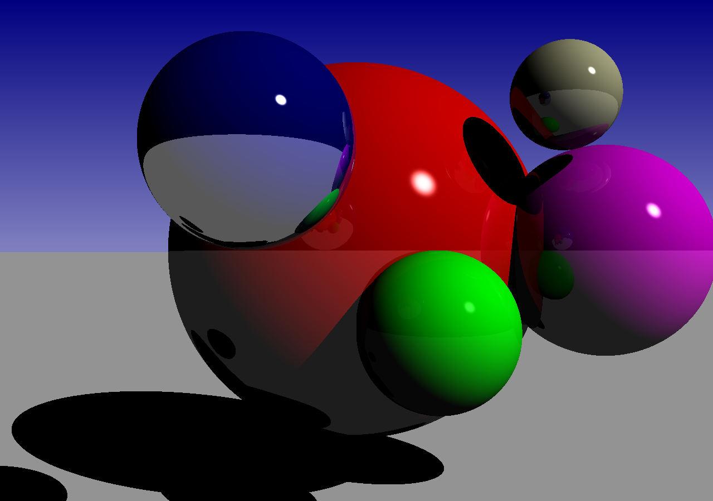
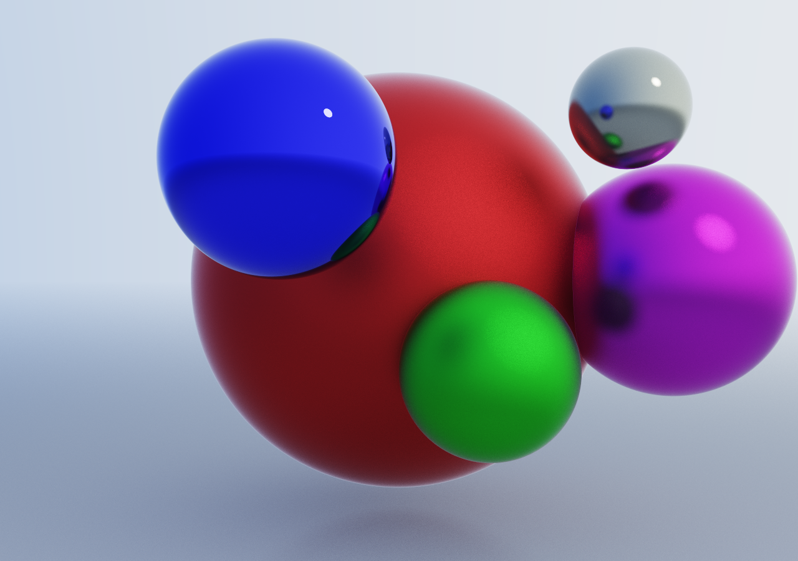

# Ray- and Path-Tracing

3D visualization is certainly one of the most fascinating applications in computer science, and certainly deserve some exta lectures. For this course, the time would never suffice to do that cautiously. 
Therefore, two examples below are not meant to be an introduction to any of the tracing methods, but only as an illustration of how "simple" such programs can be written in Julia.

The second thing is your task.

**Parallelize the Main-Loop with threads!**

## Ray-Tracing
The program is as follows.

<details>
  <summary>raytrace.jl</summary>

```julia
using Colors, Images

# -------------- geometry objects ----------------------

# 3D points and vectors
struct Vec3{T}   # parametric type to enforce type consistency
  x::T
  y::T
  z::T
end

Base.show(io::IO, v::Vec3) = print(io, "(", v.x, ",", v.y, ",", v.z, ")")

Base.:+(v::Vec3, w::Vec3) = Vec3(v.x+w.x, v.y+w.y, v.z+w.z)      # vec addition
#Base.:+(v::Vec3{T}, w::Vec3{T}) where {T} = Vec3{T}(v.x+w.x, v.y+w.y, v.z+w.z)      # enforces type consistency
Base.:-(v::Vec3, w::Vec3) = Vec3(v.x-w.x, v.y-w.y, v.z-w.z)      # vec subtraction
Base.:*(v::Vec3, w::Vec3) = v.x*w.x + v.y*w.y + v.z*w.z          # vec dot product
Base.:*(s::Real, v::Vec3) = Vec3(s*v.x, s*v.y, s*v.z)            # vec scaling
Base.:*(v::Vec3, s::Real) = s*v                                  # vec scaling
Base.:/(v::Vec3, s::Real) = v*(1/s)                              # vec scaling
×(v::Vec3, w::Vec3) = Vec3(v.y*w.z-v.z*w.y, v.z*w.x-v.x*w.z, v.x*w.y-v.y*w.x)   # cross product
# editor remark: vim in insert mode → Strg+k * X → ×, Strg+k * <letter> → greek letter, Strg+k R T → √
norm(v::Vec3) = √(v*v)                                           # length of vector
normal(v::Vec3) = v/norm(v)                                      # create normal vector

distance(v::Vec3, w::Vec3) = norm(v-w)                           # distance of vectors if considered as 3D points
perpendicular(v::Vec3, w::Vec3) = v - w*((v*w)/norm(w))          # vector through v perpendicular on w

# for generalization later
abstract type Shape end

# concrete type
struct Sphere <: Shape 
  position::Vec3
  radius
  color::Color
  reflectivity
end

# c'tors
Sphere( ;
        position      = Vec3(0.0, 0.0, 0.0),
        radius        = 1.0,
        color::Color  = RGB(1.0,1.0,1.0),
        reflectivity  = 0.2
      ) = Sphere(position, radius, color, reflectivity)
Sphere( ;
        position      = Vec3(0.0, 0.0, 0.0),
        radius        = 1.0,
        color::Symbol = :white,
        reflectivity  = 0.2
      ) = Sphere(position, radius, parse(Colorant, color), reflectivity)
# -------------- geometry objects ----------------------

# -------------- light source ----------------------
struct LightSource
  direction::Vec3
  color::Color
end

# c'tors
LightSource(; direction = Vec3(1.0, 1.0, -1.0), color::Symbol = :white) = LightSource(normal(direction), parse(Colorant, color))
LightSource(; direction = Vec3(1.0, 1.0, -1.0), color::Color = RGB(1.0,1.0,1.0)) = LightSource(normal(direction), color)
# -------------- light source ----------------------

# -------------- camera ----------------------
struct Camera
  position::Vec3
  view_direction::Vec3
  view_port_width::Unsigned
  view_port_height::Unsigned
  angle_resolution::Real
end

# c'tors
Camera(; 
       position         = Vec3(0.0,0.0,0.0), 
       view_direction   = Vec3(1.0,0.0,0.0),
       view_port_width  = 1280,
       view_port_height = 900,
       angle_resolution = 0.0008
      ) = Camera(position,view_direction,view_port_width,view_port_height,angle_resolution)
# -------------- camera ----------------------

# -------------- Rays ----------------------
mutable struct Ray
  origin::Vec3
  direction::Vec3
  color::Color
end

# c'tors
Ray(;
    origin = Vec3(0.0,0.0,0.0),
    direction = Vec3(1.0,0.0,0.0),
    color = RGB(0.0, 0.0, 0.0)
   ) = Ray(origin, normal(direction), color)
# -------------- Rays ----------------------

# ----------------- Sphere Geometry Supplier ------------------
hit(r::Ray, s::Sphere) = norm((s.position-r.origin) × r.direction) < s.radius

function intersect(r::Ray, s::Sphere)
  a = s.position - r.origin
  p = (r.direction * a)
  q = (a*a-s.radius^2)
  p^2 - q < 0 && error("Error: Tried to get point on Sphere not hit by ray!")
  t = p-√(p^2-q)
  return t, r.origin + t * r.direction
end

get_normal(s::Sphere, p::Vec3) = normal(p - s.position)
# ----------------- Sphere Geometry Supplier ------------------
# would need to be defined for any other shape, too

# convenience
Gaus(x) = exp(-0.5*x^2)

# generic handling of shapes for raytracing
# ----------------- Rendering ------------------
function find_closest_object(r::Ray, shapes)
  shape = nothing
  hit_point = nothing
  distance = Inf
  for s in shapes
    if hit(r, s)
      cd, p = intersect(r, s)
      if 0 < cd < distance
        distance = cd
        shape = s
        hit_point = p
      end
    end
  end
  return shape, hit_point
end

# maximum iterative Ray spawning
const MAX_DEPTH = 5

# ray following and ray color update
function render_ray(r::Ray, shapes, depth, lightsource)

  color = RGB(0.0, 0.0, 0.0)           # start with black

  if depth <= MAX_DEPTH

    hit_shape, hit_point = find_closest_object(r, shapes)

    if hit_shape != nothing

      hit_normal = get_normal(hit_shape, hit_point)                    # get normal on hit point (valid for spheres only)
      cosf = -(hit_normal*lightsource.direction)                       # cos(normal,light direction)
      cosd = -(hit_normal*r.direction)                                 # cos(normal,incoming ray)

      ray2light = Ray(origin = hit_point, direction = -1.0*lightsource.direction)                             # ray from hit point to light source

      shadow_shape, shadow_hit_point = find_closest_object(ray2light, filter(x -> x !== hit_shape, shapes))   # check whether shadowing objects are there

      directed_distance = 0.0                                                                                 # signed distance
      if shadow_shape != nothing
        cd, p = intersect(ray2light, shadow_shape)
        directed_distance = (p - ray2light.origin)*ray2light.direction
      end

      # start color determination
      if cosf>0.0 && ( shadow_shape == nothing || directed_distance < 0.0)                                    # insert shadows
        color = clamp01(hit_shape.color*cosf)
      end

      color = clamp01(color * (1.0 - hit_shape.reflectivity))                                                 # insert reflectivity

      # follow reflected ray recursively
      reflect_ray = render_ray(Ray(origin = hit_point, direction = hit_normal*(2.0*cosd) + r.direction), shapes, depth+1, lightsource)
      color = clamp01(color + reflect_ray.color*hit_shape.reflectivity)                                       # combine color with reflected color

      # add headlights
      if cosf>0.0 && ( shadow_shape == nothing || directed_distance < 0.0)
        cosrf = -(reflect_ray.direction*lightsource.direction)
        reflc = hit_shape.reflectivity
        color = clamp01(color + lightsource.color * (Gaus((cosrf-1.0)/(0.005*(1.0-reflc)))*(5.0*reflc)))
      end

      r.color = color
    end
  end

  return r
end

# here runs the for loop over each image pixel
function render_image(camera, shapes, lightsource)
  dimX = camera.view_port_width
  dimY = camera.view_port_height
  focalVec = normal(camera.view_direction)
  vy = normal(Vec3(0.0, 1.0, 0.0))
  vz = focalVec × vy
  res = camera.angle_resolution

  pixel_matrix = zeros(RGB{N0f8}, dimY, dimX)
  for x in 1:camera.view_port_width, y in 1:camera.view_port_height
    gradient = min(1.0, y/camera.view_port_height)
    pixel_matrix[y,x] = RGB(gradient, gradient, min(0.5(1+gradient),1.0))  # color gradient background
    ray = render_ray(Ray(origin = camera.position, direction = focalVec + vy*(res*(0.5*dimX-x)) + vz*(res*(0.5*dimY-y)), color = pixel_matrix[y,x]), 
                     shapes, 
                     0,
                     lightsource)
    pixel_matrix[y,x] = ray.color
  end
  return pixel_matrix   
end 
# ----------------- Rendering ------------------

# -------------- Scene Setup and Rendering --------------------
to_tuple(c::RGB) = (round(Int, red(c)*255), round(Int, green(c)*255), round(Int, blue(c)*255))
Colors.color_names["darkbeige"] = to_tuple(RGB(0.784, 0.784, 0.608))

shapes = Shape[]
push!(shapes, Sphere(position = Vec3( 7.0, -1.0, -1.0), radius = 1.0, color = :green1,     reflectivity = 0.05))
push!(shapes, Sphere(position = Vec3(10.0,  0.0,  0.0), radius = 3.0, color = :red1                           ))
push!(shapes, Sphere(position = Vec3( 5.0,  1.0,  1.0), radius = 1.0, color = :blue1,      reflectivity = 0.6 ))
push!(shapes, Sphere(position = Vec3( 7.5, -2.7,  2.0), radius = 0.7, color = :darkbeige                      ))
push!(shapes, Sphere(position = Vec3( 8.5, -3.5,  0.0), radius = 1.5, color = :magenta                        ))
# ground
push!(shapes, Sphere(position = Vec3( 0.0,  0.0, -1.0e6), radius = 1.0e6 - 4.0, color = :white, reflectivity = 0.001 ))

camera = Camera(position = Vec3(-1.5, 0.0, 0.0))

# Render Image
image = render_image(camera, shapes, LightSource())
save("render_result.png", image)
# -------------- Scene Setup and Rendering --------------------
```
</details>

This program is admittedly already a bit more complex. It is supposed to be extended with shapes other then only spheres. Or, material properties can be extended - though the solution for the following path-tracing is imho more appealing.

It requires the modules `Colors` and `Images` to be installed. And then, it can be executed via `julia raytrace.jl`. A PNG file with the result is produced (if everything works well).
The serial program may run in about 30 seconds. You can change the view port resolution (and reduce the angle resolution accordingly) if you want more workload.

#### Exercise
Finding the main loop is certainly not that hard. Parallelize it with threads. Check the scaling! (Does parallelism accelerate?)

<details>
  <summary>Plot-Result</summary>

<div align="center">
  
</div>
</details>

## Path-Tracing

Path-tracing almost follows correctly the light path. The nice online-book, [`physical based rendering`](https://www.pbr-book.org/), can teach you much more. Path-tracing (not only for the anit-aliasing, what we had could introduce also for the ray-tracing program) is a Monte-Carlo method. These usually have great potential to benefit from parallelism. 

The program is as follows.

<details>
  <summary>pathtrace.jl</summary>

```julia
using LinearAlgebra
using Images
using Random
using ProgressMeter

const Vec3 = Vector{Float64}

struct Ray
  origin::Vec3
  direction::Vec3           # normalized to 1
end

struct Material
  albedo::Vec3              # [R,G,B] in [0,1]
  emission::Vec3            # [R,G,B] > 0
  roughness::Float64        # in [0,1]
  metallic::Float64         # in [0,1]
end


struct Sphere
  center::Vec3
  radius::Float64           # > 0
  material::Material
end


function random_in_unit_sphere()
  while true
    p = [rand()*2-1, rand()*2-1, rand()*2-1]
    if dot(p, p) < 1.0 return p end
  end
end

function random_in_hemisphere(normal::Vec3)
  p = normalize(random_in_unit_sphere())
  return dot(p, normal) > 0.0 ? p : -p
end

function reflect(v, n)
  return v - 2.0 * dot(v, n) * n
end

function schlick_fresnel(cos_theta, f0)
  return f0 .+ (1.0 .- f0) .* (1.0 - cos_theta)^5
end

# --- Geometry ---
function intersect(ray::Ray, s::Sphere)
  oc = ray.origin - s.center
  a = dot(ray.direction, ray.direction)
  b = 2.0 * dot(oc, ray.direction)
  c = dot(oc, oc) - s.radius^2
  discriminant = b^2 - 4*a*c
  if discriminant < 0 return -1.0 end
  t = (-b - sqrt(discriminant)) / (2.0*a)
  return t > 0.001 ? t : -1.0
end

# --- Illumination & Tonemapping ---
function aces_tonemap(x::Vec3)
  a, b, c, d, e = 2.51, 0.03, 2.43, 0.59, 0.14
  @. clamp((x * (a * x + b)) / (x * (c * x + d) + e), 0.0, 1.0)
end

function mix(a, b, t)
  return a .* (1.0 - t) .+ b .* t
end

# --- path tracer kernel ---
function trace_path(ray::Ray, scene, depth::Int, include_emission::Bool=true)
  if depth <= 0 return [0.0, 0.0, 0.0] end    # maximum iteration reached, return black

  # find closest object intersecting with ray ... if any
  closest_t = Inf
  hit_obj = nothing
  for obj in scene
    t = intersect(ray, obj)
    if 0.001 < t < closest_t
      closest_t = t
      hit_obj = obj
    end
  end

  if hit_obj === nothing 
    # fancy color gradient background
    # scale y direction from [-1, 1] to [0, 1]
    t = 0.5 * (ray.direction[2] + 1.0)

    # color definition (RGB-values in HDR-space)
    horizon_color = [0.8, 0.9, 1.0]   # light blue at horizon
    zenith_color    = [0.1, 0.2, 0.5] # dark blue at zenith

    # mix linearly between both colors -> gradient
    return mix(horizon_color, zenith_color, t)
  end 


  hit_point = ray.origin + ray.direction * closest_t
  normal = normalize(hit_point - hit_obj.center)
  mat = hit_obj.material
  
  # 1. emission (directly seen)
  result = include_emission ? mat.emission : [0.0, 0.0, 0.0]

  # 2. next event estimation (NEE; direct light)
  for obj in scene
    if sum(obj.material.emission) > 0 && obj !== hit_obj
      # sample point on light source (simplified: center)
      light_dir_full = obj.center - hit_point
      light_dist = norm(light_dir_full)
      light_dir = light_dir_full / light_dist
      
      # check shadows
      shadow_ray = Ray(hit_point, light_dir)
      in_shadow = false
      for s_obj in scene
          st = intersect(shadow_ray, s_obj)
          if 0.001 < st < light_dist - 0.001
              in_shadow = true; break
          end
      end

      if !in_shadow
          cos_l = max(0.0, dot(normal, light_dir))
          # diffusive fraction for light sources
          result += (mat.albedo ./ pi) .* obj.material.emission .* cos_l
      end
    end
  end

  # 3. indirect light (mirror vs. diffusiv)
  f0 = mix([0.04, 0.04, 0.04], mat.albedo, mat.metallic)
  f = schlick_fresnel(max(0.0, dot(-ray.direction, normal)), f0)
  
  if rand() < max(f...) # probability to mirror
    spec_dir = normalize(reflect(ray.direction, normal) + mat.roughness * random_in_unit_sphere())
    incoming = trace_path(Ray(hit_point, spec_dir), scene, depth - 1, true)  
    incoming_clamped = clamp.(incoming, 0.0, 20.0)    # catching fireflies

    result += f .* incoming_clamped
  else
    # diffusiv (unless fully metallic)
    if mat.metallic < 1.0
      diff_dir = random_in_hemisphere(normal)
      kd = (1.0 .- f) .* (1.0 - mat.metallic)
      indirect = trace_path(Ray(hit_point, diff_dir), scene, depth - 1, false)
      result += (mat.albedo .* indirect .* kd) # PDF & Lambert cut out each other in part in uniform sampling
    end
  end

  return result
end

# --- szene & rendering ---
function render()
  w, h = 1024, 720                     # window width and height (400,300 for small test)
  samples = 200                        # samples per pixel; higher for better quality (less noise) (50 for small test)
  exposure = 1.5                       # lighter image > 1
  depth = 5                            # number of bounces (5 for small test)
  scale = 0.73                         # zoom factor
  img = zeros(RGB{Float64}, h, w)      # pixel map

  scene = [
    Sphere([0,0,-1.0e6], 1.0e6-3.3, Material([0.5, 0.5, 0.5], [0,0,0], 0.1, 0.0)),       # ground
    Sphere([7., -1., -1.], 1.0, Material([0.03, 1.0, 0.03], [0,0,0], 0.7, 0.6)),         # green
    Sphere([10.,0.,0.], 3.0, Material([1.0, 0.03, 0.03], [0,0,0], 0.7, 0.6)),            # red
    Sphere([5.,1.,1.],1.0, Material([0.03, 0.03, 1.0], [0,0,0], 0., 0.9)),               # blue
    Sphere([7.5, -2.7,  2.0], 0.7, Material([0.784, 0.784, 0.608], [0,0,0], 0.1, 0.7)),  # beige
    Sphere([8.5, -3.5,  0.0], 1.5, Material([1.0, 0.03, 1.0], [0,0,0], 0.3, 0.6)),       # magenta
    Sphere([-2., -10., 10.], 1., Material([0,0,0], [150, 150, 150], 0, 0))               # light source rear
  ]

  @showprogress for x in 1:w
    for y in 1:h
      col = [0.0, 0.0, 0.0]
      for s in 1:samples
        u = -((x + rand() - w/2) / h ) * scale            # x pixel position
        v = -((y + rand() - h/2) / h ) * scale            # y pixel position
        ray = Ray([-1.5, 0, 0], normalize([1, u, v]))     # camera assumed at [-1.5,0,0] pointing to [1, 0, 0]
        col += trace_path(ray, scene, depth)              # update color values (arithmetic mean)
      end
      
      # post-processing
      col /= samples                                      # devide by sample size (arithmetic mean)
      hdr_col = col .* exposure                           # light up
      final_col = aces_tonemap(hdr_col) .^ (1.0 / 2.2)    # tone-map (human perception) and gamma correction
      img[y, x] = RGB(final_col...)                       # assign to final pixel matrix
    end
  end
  save("path_traced_scene.png", img)
end

render()
```
</details>

The programm appears a bit more "rudimentary" than the above ray-tracing example. It lacks some finess concerning the user interface of the data structures (see the comments on e.g. variable restrictions). The program contains otherwise the same essential data structures as the ray-tracer, and also represents the same scene setup (5 colored spheres in the same arrangement). As an illustration for parallelism, it will have to suffice.

It requires the modules `Images` and `ProgressMeter` in addition (the latter is maybe only a nice gimick - a progress bar; cool thing: It is thread-compatible!). 
The script can be executed via `julia pathtrace.jl`. A PNG file with the result is produced. The serial program runs for about 10 minutes. (Caution! `Images` is really a monster. It might take long to precompile.)

#### Exercise
Find the main loop, and parallelize it with threads, or with `Distributed` workers. Check the scaling!

<details>
  <summary>Plot-Result</summary>

The following picture was created using
```julia
w, h = 1280, 900
samples = 1024
depth = 12
```
With 80 threads, it took about half an hour (35 minutes) on a 80 cores of a Intel Icelake processor. (Quality is hopefully better. Less noise.)

<div align="center">
  
</div>
</details>

Next to that, there appears to be flaw in this program. It is way slower than actually necessary. In the solution section, you can see an alternative, fully parallelized using master/worker, and avoind `Images` ... and is *really* faster! (On 112 CPUs, with the 1290x900 settings, just a minute!!)

## Remark
The `Images` module is huge wrt. to its dependencies. Precompilation requires possibly quite some time. Ahead-of-time compilation is advisable. But also file system access can become a bottleneck. Loading one or few instances of a library, is usually not an issue. But if libraries are large, and really many processes at a time try to access it ... Boom! 
Maybe, just avoid such packages in HPC workflows altogether. This is unfortunately a real pitfall in julia.
